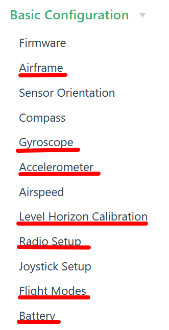
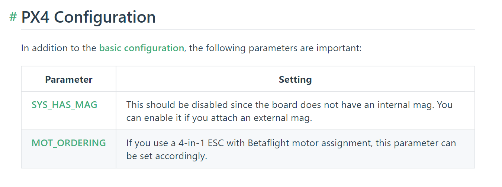
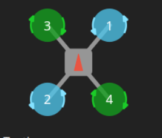
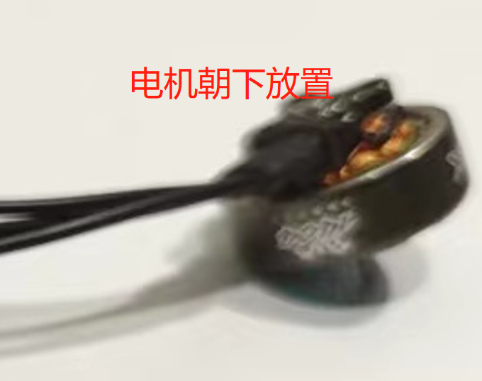

# Autopilot

## 1. PX4 Autopilot

### 1.1 PX4 Autopilot Firmware Flashing

Disconnect the battery, insert the TF card into the flight controller, and then use a USB cable to flash the firmware.

If you are using Holybro KakuteH7v2, you need to flash the PX4 firmware following this [link](https://docs.px4.io/main/en/advanced_config/bootloader_update_from_betaflight.html#dfu-util).
First you need to install the firmware from the official [repo](), next compile it, then replace `build/<target>/<target>.bin` to the path of your compiled binary file.

### 1.2 Autopilot Parameter Configuration

Connect the flight controller to the computer with a USB cable and open the QGC software, and wait for the flight controller to connect. Refer to the video in <https://docs.px4.io/main/en/config/>, or the graphic tutorial on that webpage, to set up Airframe, calibrate Gyroscope, accelerometer, and Level Horizon, configure Radio channels, Flight Modes, and Battery step by step. Choose the **Generic X Type** quadcopter for Airframe, and the specific type can be DJI F330. Different types correspond to different preset parameters. Later, the parameters used by this aircraft will be reloaded.

\*\*Important: Next, you need to set the two parameters shown in the following figure in the _Parameters_ option (Parameters) of QGC to ensure the safe takeoff and flight of the drone\*\*

### 1.3 Test Motor Rotation Direction

The normal direction of motor rotation should be as shown in the following figure. The red arrow points to the direction of the aircraft's head, which is the direction indicated by the triangle-shaped marking on the flight controller. When the four motors are placed **facing downwards** (as shown in the figure), the direction of rotation as viewed from **above** should be as indicated by the arrow in the figure. To test the motor rotation, you need to power on the battery (do not install the propellers!) and then you can use one of the following two methods to check the motor rotation.

1. Method 1: **Use QGC**
   - Please refer to <https://docs.qgroundcontrol.com/master/en/SetupView/Motors.html> for the new method provided by the official. _It looks very convenient but we haven't tried it yet._
2. Method 2: **Use the remote controller**
   - First unlock the remote controller joystick with the eight shape, and then gently push the throttle to make the motor rotate. In order to prevent the motor from flying around, you can find something to support the middle board, and then use your hand to hold the motor wire to make the motor hang in the air. Check the direction of all the motors and record whether the direction of the motors is correct. If the direction is wrong, reverse two motor wires and re-solder them. Then test the direction of the motor again to ensure that the direction is correct.

## 2. Ardupilot Flight Controller (APM)

There are two reasons for using APM firmware: (1) the Kakute H7V2 cannot be flashed with PX4 firmware (Although you can flash the firmware, you cannot arm the drone); (2) APM firmware supports bi-directional Dshot, which can increase the upper limit of motor speed feedback frequency, and is suitable for use scenarios that require motor speed feedback (although it seems that the PX4 is going to support bi-directional Dshot recently). In short, if you are using Kakute H7V2 or Kakute Mini, or need high frequency motor speed feedback, APM firmware is recommended.

### 2.1 Firmware Flashing

Here is an example of firmware flashing for Kakute series flight control. First, use the Stm32CubeProgrammer software to flash the Bootloader.

1. The Bootloader can be downloaded from https://firmware.ardupilot.org/Copter/stable-4.3.5/. Note that the corresponding version of Kakute H7V1 is KakuteH7-bdshot; the corresponding version of Kakute H7V2 is KakuteH7v2; the corresponding version of Kakute H7Mini is KakuteH7Mini-Nand.
2. Enter the corresponding directory of the above URL, download the arducopter_with_bl. hex file, press and hold Reset to enter DFU mode, and finally use the `Stm32CubeProgrammer` software to flash it.
3. After the Bootloader and the flight control firmware have been successfully flashed, open the QGC or Mission Planner and other ground stations can already be successfully connected with the flight control.
4. If you need to use your own modified flight control, you do not need to flash the bootloader again, you may flash compiled firmware generated apj file directly in the QGC.

### 2.2 Firmware parameters debugging

After the successful flashing of the firmware, in order to debug the aircraft, to achieve hand control performance, while being able to correctly communicate with the upper computer, you need to make the corresponding firmware parameters adjustment.
Specific reference to the document here: https://charmyoung.notion.site/APM-697b52589579465991e380da97c71c61#f20fdc5555d44b1fba0b05fae0ea1c65

Among them, the most noteworthy options are: (1) GUID_OPTIONS needs to be set to 9; (2) the upper, middle and lower modes of Channel5 of the remote control are set to Stabilize, Stabilize, and Guided_Nogps; (3) MOT_THST_EXPO is recommended to be set to 0, which means the flight control is completely using linear throttle model, so that the hover_percentage in px4_controller can be set directly to the hover throttle value.
