# Installation of Drone Body

## 1.1 Motor ESC

Take out the Electronic speed control(ESC) and four motors as shown in the figure below. The ESC may have been purchased together with the flight controller as a flight tower, and needs to be removed first for convenient soldering of the circuit. The white interface on the top of the ESC is for connecting the data cable of the flight controller, and the metal solder pads below will be soldered with power supply connectors. There are a total of 3x4 solder pads on the left and right sides, corresponding to four three-phase brushless motors. Numbers 1, 2, and 3 in the figure correspond to the three wires of a motor.

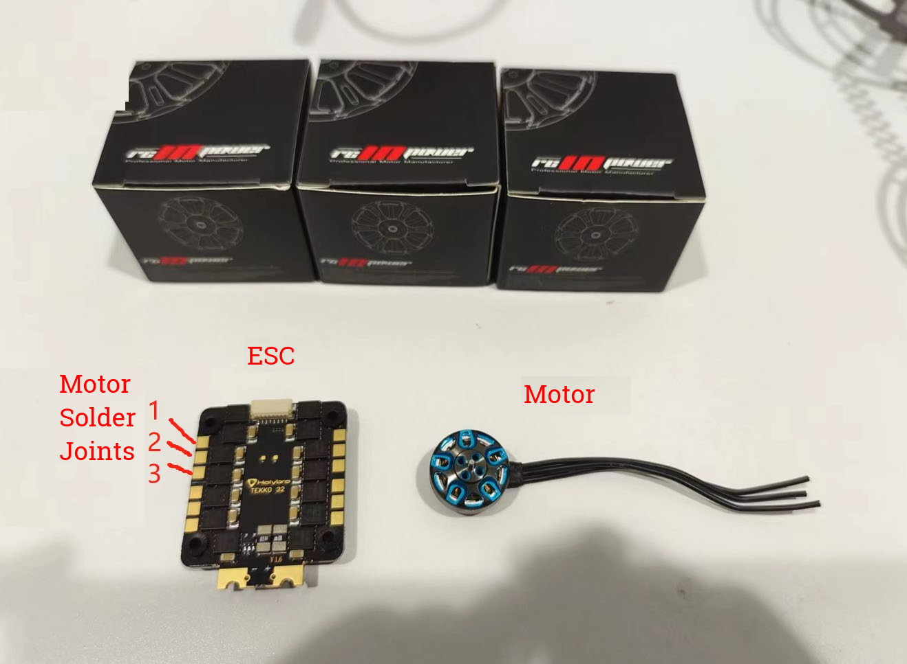

## 1.2 Welding the Motor

Shorten or lengthen the motor wires to about 75mm. For Betaflight series motors, the manufacturer shortens the wires to save money, so you need to extend the wires yourself. Pay attention to putting heat shrink tubing on the soldering points to prevent short circuits. The welding sequence can be welded according to the line sequence diagram below. The motor is placed axially upwards, marked from top to bottom as lines 1, 2, and 3, corresponding to the 1st, 2nd, and 3rd positions on the solder pads of the ESC. For Betaflight 1506 motors or Zhiying Power 1404 motors, as well as Holybro TEKKO 32 ESC, there is no need to adjust the line sequence after welding according to the order in the figure. (For three-phase brushless motors, there is no positive or negative polarity. If any two wires are reversed, the direction of the motor rotation will be reversed)

Tips: When welding, you can evenly apply solder to both ends of the wire or solder pad first, then place them together and use a soldering iron to heat the solder that has been applied to make them stick together. This method is more efficient and has a higher success rate. At the same time, pay attention not to heat the soldering pad for a long time. After the solder melts and sticks together, you can remove the soldering iron. Otherwise, the high temperature of the ESC may cause damage to electronic components. Beginners can pull the wire after welding to see if it is firmly welded.

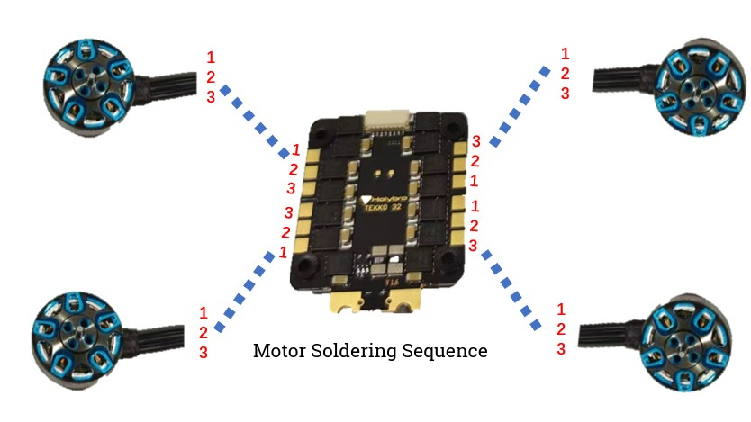<figcaption>Motor wire sequence diagram</figcaption>

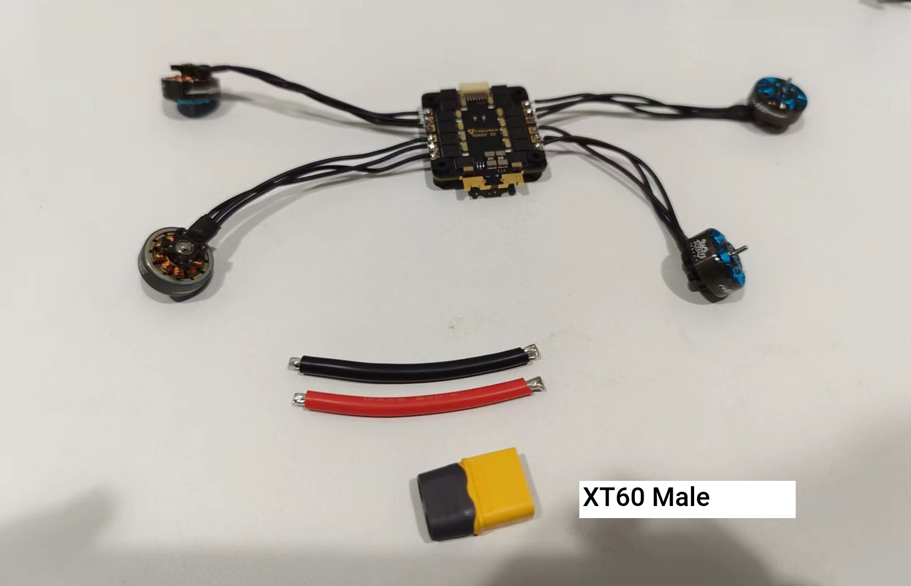<figcaption>Motor wire sequence diagram</figcaption>

## 1.3 Wiring the Power Supply

Solder the XT60 connector and the positive and negative wires to the soldering pads located below the ESC. If the XT60 connector and wires are sold together (as shown in the small image below), you only need to solder them to the ESC. If the wires are too long, you can cut them to about 5cm in length before soldering.

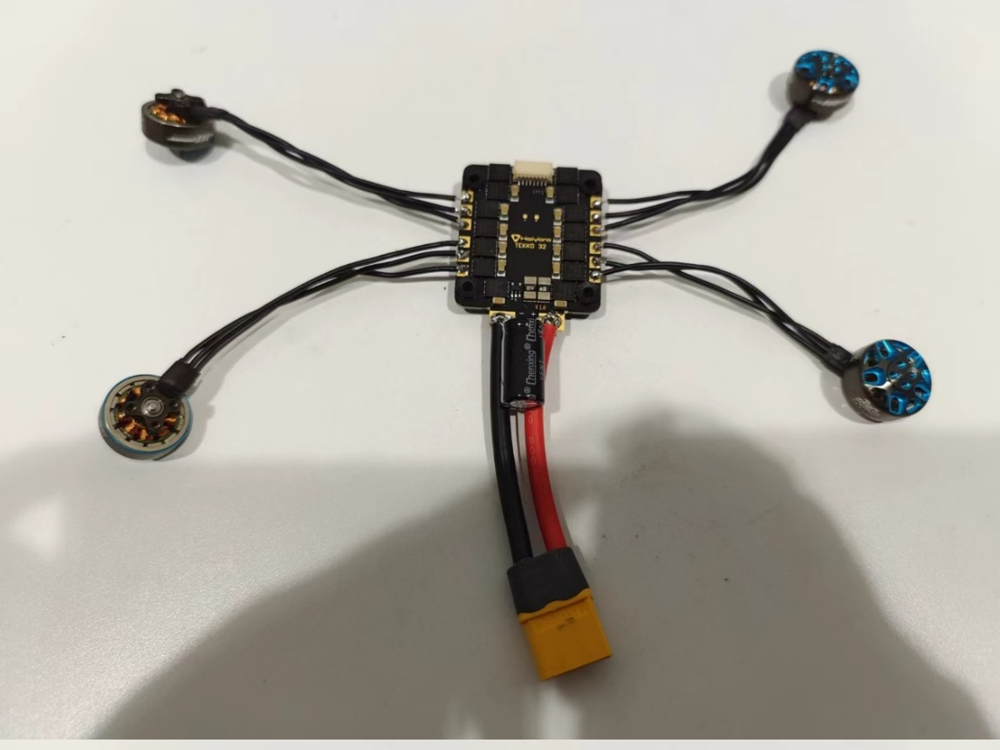

If the ESC comes with a capacitor or you have a larger capacitor with a rated voltage greater than 20V, you can solder it to the solder pad in parallel with the power supply wires by shortening the positive and negative terminals (the negative terminal is usually marked with a "-" sign), as shown in the figure below after soldering is completed:

> Tips: After soldering is completed, it is recommended to use a multimeter to test whether the positive and negative terminals are short-circuited (there should generally be a resistance value of several hundred ohms or more, and should not be directly short-circuited), to ensure that the soldering is correct. If a flight computer is to be installed later, two wires need to be led out from the power supply solder pads and connected to an XT30 connector or other plug for supplying power to the flight computer in the future.

## 1.4 Connecting the flight controller

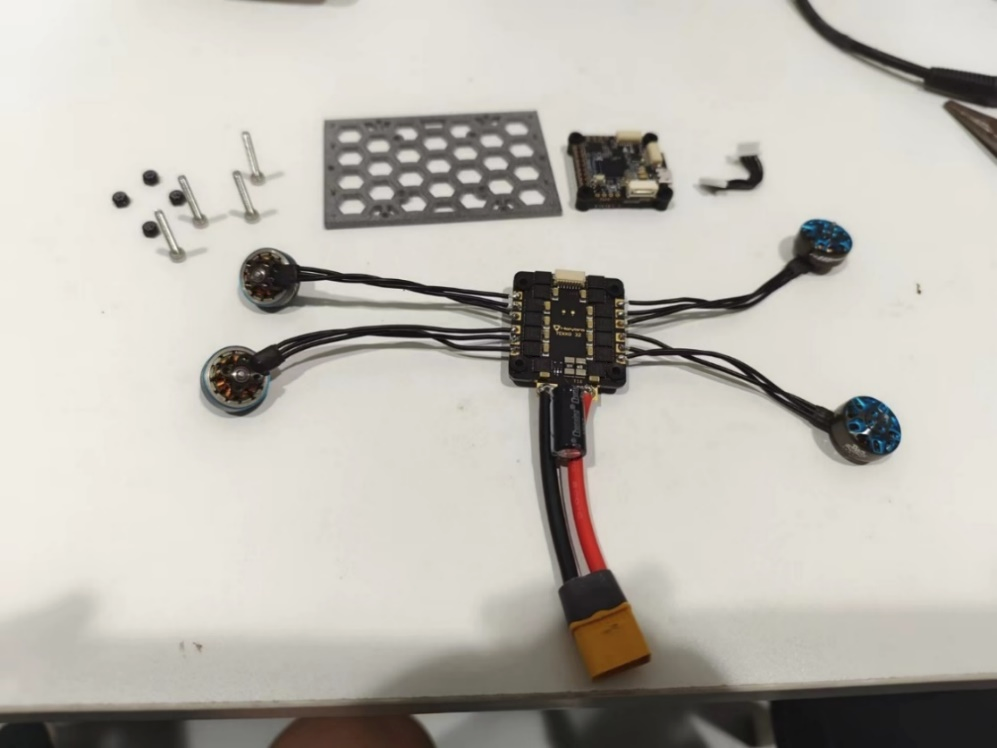

Remove the flight controller, long M3 screws and anti-loose nuts (which should come with the flight controller and ESC kit), and then use screws to install the flight controller, ESC and the 3D-printed intermediate plate together. Put shock-absorbing rubber sleeves on the screws between the flight controller and ESC, and between the ESC and the 3D-printed board. Pay attention to the direction indicated by the triangular silk screen on the flight controller, which is the front direction and should be consistent with the front direction of the ESC (the direction with the white connector). The 3D-printed intermediate plate has no front or back direction.

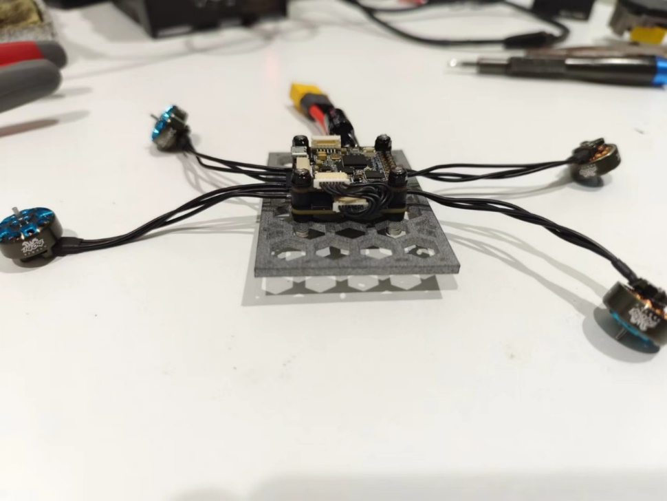

After installing the screws, connect the signal ribbon cable between the flight controller and ESC, with the connector towards the front direction. The top view and front view of the completed connection are shown below:

## 1.5 Connecting the Receiver

The receiver is mainly responsible for receiving signals from the remote control to control the drone. The signal ports of the receiver (Output1, SBUS) are connected to R6 of the flight controller, which requires a power supply of 5V. The connection steps are as follows: locate the 6-pin plug on the flight controller and connect it to the interface shown in the red box in the figure below. The wiring sequence is shown in the lower right corner, so the left two wires of the 6-pin plug (R6, G) need to be soldered respectively to the signal port (Output1, SBUS) and GND of the receiver. **The R1, T1, and G wires on the right side of the 6-pin plug are reserved and will be used for communication with the onboard computer later.** The wire corresponding to 9V on the far right is not used and can be cut off. In addition, the receiver needs a power supply of 5V, which can be connected to the corresponding 5V port of the receiver with the left 5V port of the plug that has been cut off or other wires.

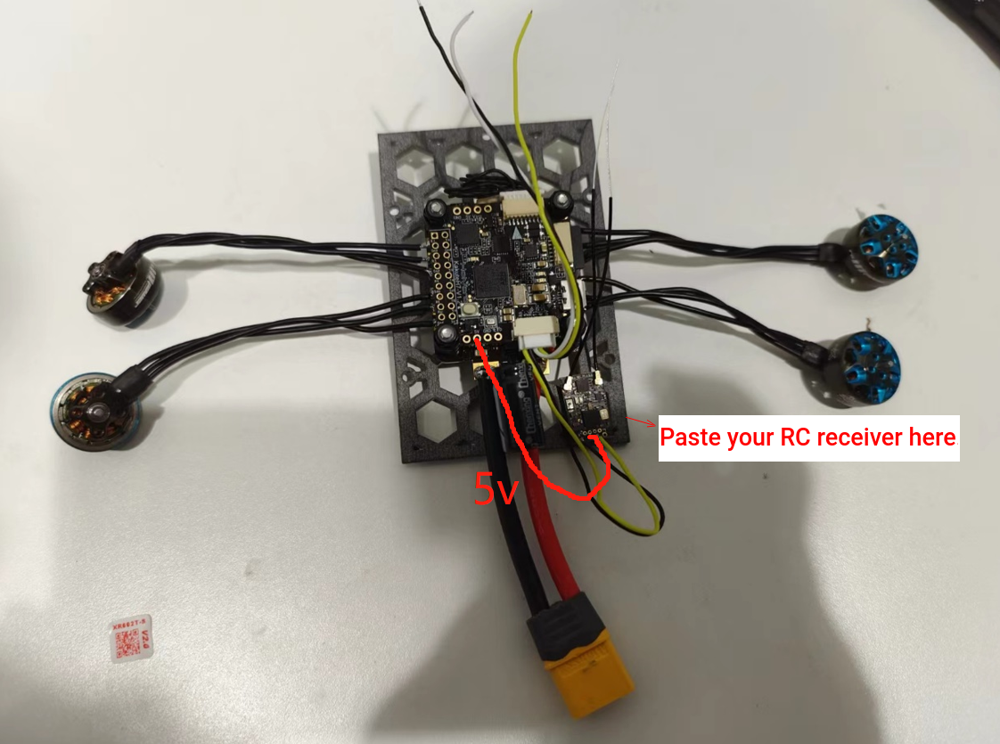

After the connection is completed, it should look like the figure below. Use foam double-sided tape to stick the receiver to the lower right corner of the 3D printed board, mainly to avoid blocking the screw holes.

## 1.6 Connecting the TTL to USB module

In step 1.5, we have reserved the T1, R1, and G interfaces on the flight controller, which are the send, receive, and ground interfaces. Here, T1, R1, and G should be connected to RX, TX, and G of the USB to TTL module, respectively, that is, receive to send, and send to receive. The power supply line does not need to be connected, and the USB to TTL module will be powered by the USB port of the onboard computer (HUB). The connection diagram is as follows:

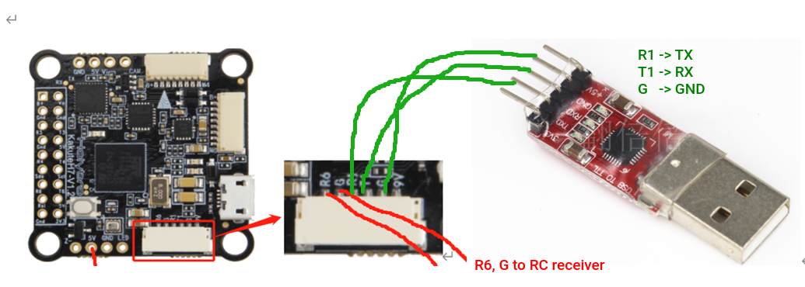

## 1.6 Remote Control Pairing

Connect the XT60 plug to the 4S lithium battery purchased for power supply. After powering on, the receiver light is on and flashing slowly, indicating that it is not paired. Press and hold the button in the circle in the figure below for 2 seconds, and the receiver indicator light will flash quickly, entering pairing mode. Turn on the Futaba remote control, and the receiver light will stay on when the pairing is successful. When the remote control is turned on, it will automatically search for available receivers. Therefore, when the receiver is in pairing mode, simply turn on the remote control to pair.

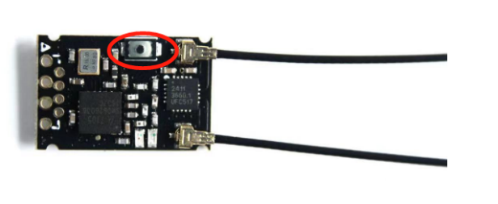

## 1.10 Installing Wireless Data Transmission

Solder the TX, RX, 5V, and GND of the wireless data transmission module to the T4, R4, 5V, and GND of the flight controller, respectively, as shown in the figure. Then, use double-sided foam tape to attach the wireless data transmission module horizontally to the front end of the 3D printed board.

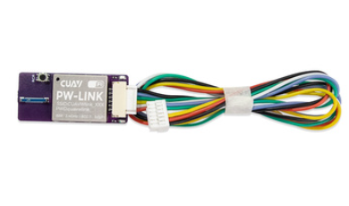
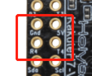

## 1.11 Parameter Configuration

To configure parameters, connect the flight controller to the computer using a USB cable and wait for the connection to complete in QGC software. Then, use one of the following methods:

1. Load the parameter list directly through QGC:
   - Click on the G icon in the upper left corner -> Vehicle Setup -> Parameters.
   - Click on Tools in the upper right corner -> Load Parameters.
   - Select `Mantis3.params` and the required parameters will be updated.
   - Restart the flight controller by unplugging and re-plugging the USB cable.
   - To ensure that the parameter modification is successful, wait for QGC to connect again (if it fails to connect, restart QGC or check if the USB cable is properly connected).
   - Click on the G icon in the upper left corner -> Vehicle Setup -> Parameters.
   - Search for MAV and check if `MAV_1_Config` is set to `GPS1`, `MAV_1_Mode` is set to Normal, `MAV_2_Config` is set to `TELEM1`, and `MAV_2_Mode` is set to Onboard.
   - If not, the parameter modification is incorrect and should be manually modified using Method 2.
   - Search for `MC_PITCHRATE_P` and check if it is set to 0.08.
   - If not, the parameter modification is incorrect and should be manually modified using Method 2.
   - After completing the above checks, disconnect the USB cable and power the flight controller using a battery. The wireless data transmission is now working, and the computer can search for WIFI: CUAVWLINK with the password `cuavwlink` to wirelessly connect to the flight controller.
2. Manually modify parameters:
   - To ensure that the wireless data transmission works properly, the parameters indicated in red in the figure below must be configured:
   - Connect the flight controller via USB (battery disconnected), open the QGC software, click the G icon in the upper left corner, go to Vehicle Setup, and then Parameters. Search for MAV.
   - Note that MAV_1_MODE and others will only appear if GPS1 is selected instead of Disable in `MAV_1_CONFIG`. Similarly, `MAV_2_MODE` will only appear if TELEM1 is selected instead of Disable in `MAV_2_CONFIG`. If `MAV_1_MODE` or `MAV_2_MODE` do not appear after selection, disconnect the USB cable, close QGC, reconnect, and search for the parameter again.
   - Once the configuration is completed, disconnect the USB cable and power the flight controller with a battery. The wireless data transmission should work now. Search for WIFI: CUAVWLINK xxxx on your computer, enter the password `cuavwlink`, and connect to the WIFI network. Then open the QGC software to wirelessly connect to the flight controller.

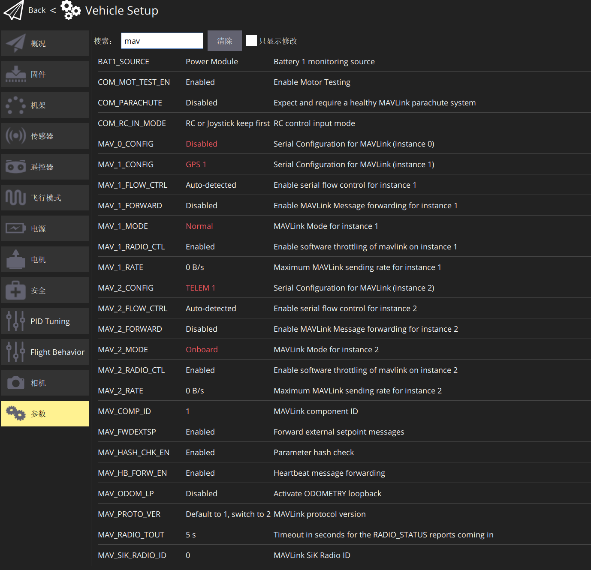
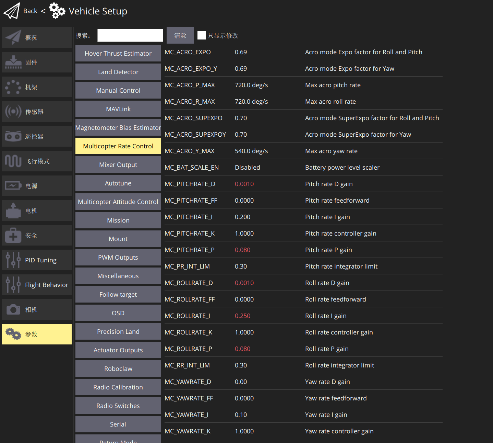
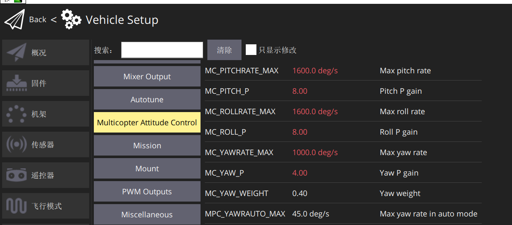

Next, you need to further modify the PID parameters of the flight controller. You can use either USB or wireless transmission to connect to QGC. Click the G icon in the upper left corner, go to Vehicle Setup, and select Parameters. Then, choose Multicopter Rate Control and Multicopter Attitude Control, and modify the relevant parameters as shown in the following figure (default parameters are white, and modified parameters are red).

## 1.12 Assembling the Drone Frame

Insert the board that was just installed from the bottom of the mainboard (as shown in the figure below), making sure that the motor wires are threaded out near the slot without being compressed, and the same is true for the wires of other components, which must not be compressed. Then use M2.6 x 8 self-tapping screws (with pointed ends) to connect the board to the mainboard, and install the four motors upside down on the motor base of the mainboard. The motor installation uses M2x6 ordinary hexagon screws (not self-tapping). The screw length provided with the motor box may not be suitable, so you need to choose M2x6 ordinary hexagon screws by yourself, and note that **the tip of the screw cannot touch the copper wire of the motor!**
Finally, use M2.6 x 12 self-tapping screws to connect the landing gear to the mainboard. The screws on the landing gear and mainboard are fitted with a shock-absorbing rubber sleeve, as shown in the figure on the far right. After installation, thread a hook and loop fastener through the gap between the two for attaching the battery. Do not install the propellers yet!

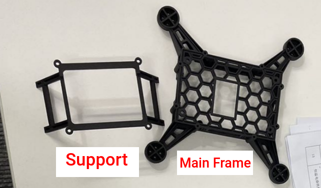 
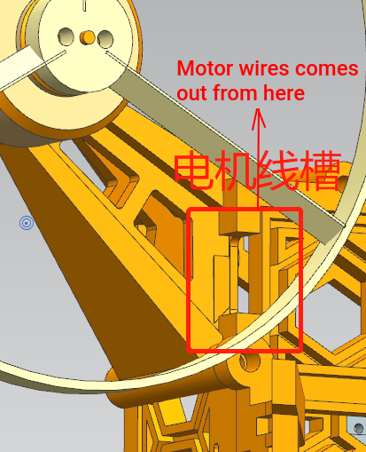 
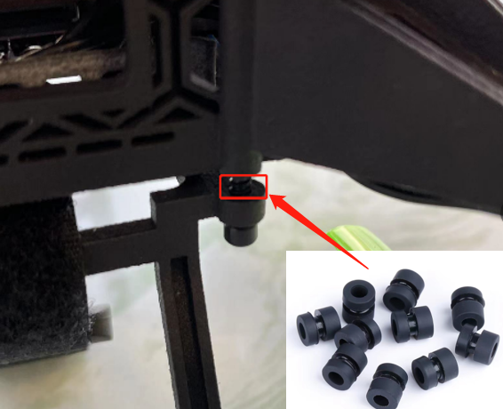
After the assembly is completed, it should look like the image below.

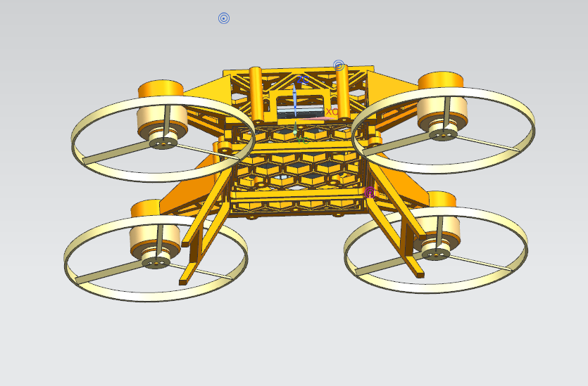 
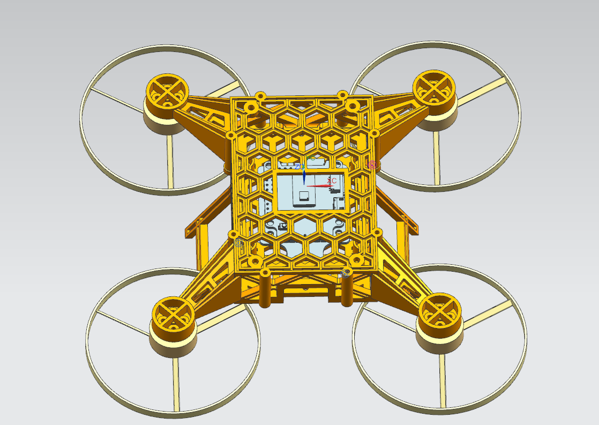
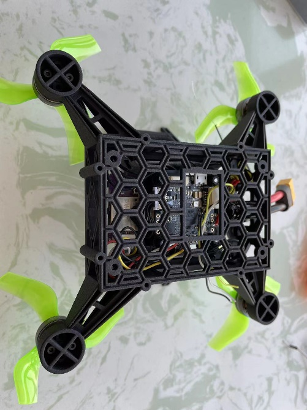 
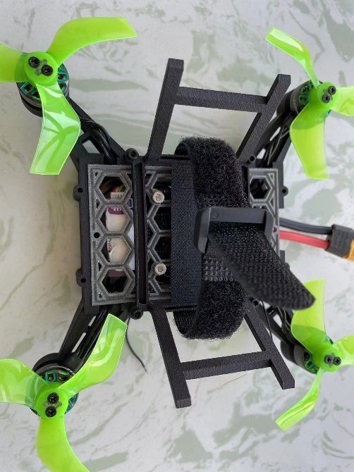

> Do not install the propellers at this point to avoid potential danger in the next step.
