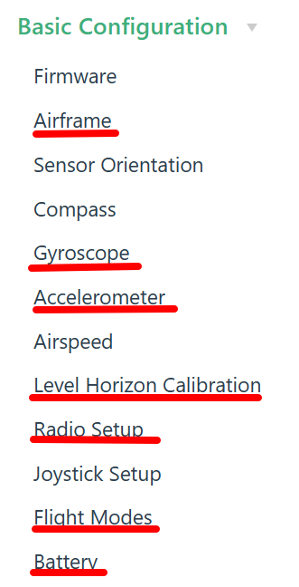
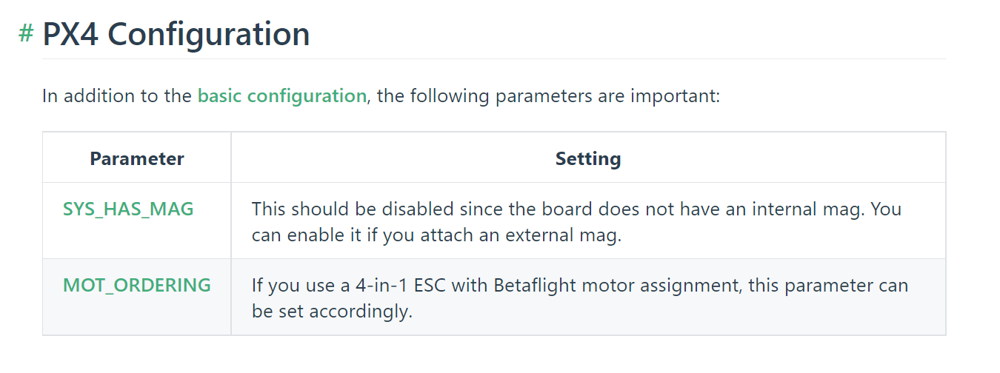
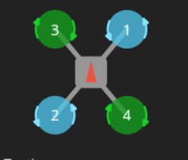

# 2. Flight Controller

## 2.1 Flight Controller Firmware Flashing

Disconnect the battery, insert the TF card into the flight controller, and then use a USB cable to flash the firmware. The flight controller firmware flashing tutorial can be found in the Holybro Kakuto H7 flashing px4 tutorial.docx.

## 2.2 Flight Controller Parameter Configuration

Connect the flight controller to the computer with a USB cable and open the QGC software, and wait for the flight controller to connect. Refer to the video in <https://docs.px4.io/main/en/config/>, or the graphic tutorial on that webpage, to set up Airframe, calibrate Gyroscope, accelerometer, and Level Horizon, configure Radio channels, Flight Modes, and Battery step by step. Choose the **Generic X Type** quadcopter for Airframe, and the specific type can be DJI F330. Different types correspond to different preset parameters. Later, the parameters used by this aircraft will be reloaded.

\*\*Important: Next, you need to set the two parameters shown in the following figure in the _Parameters_ option (Parameters) of QGC to ensure the safe takeoff and flight of the drone\*\*

## 2.3 Test Motor Rotation Direction

The normal direction of motor rotation should be as shown in the following figure. The red arrow points to the direction of the aircraft's head, which is the direction indicated by the triangle-shaped marking on the flight controller. When the four motors are placed **facing downwards** (as shown in the figure), the direction of rotation as viewed from **above** should be as indicated by the arrow in the figure. To test the motor rotation, you need to power on the battery (do not install the propellers!) and then you can use one of the following two methods to check the motor rotation.

1. Method 1: **Use QGC**
   - Please refer to <https://docs.qgroundcontrol.com/master/en/SetupView/Motors.html> for the new method provided by the official. _It looks very convenient but we haven't tried it yet._
2. Method 2: **Use the remote controller**
   - First unlock the remote controller joystick with the eight shape, and then gently push the throttle to make the motor rotate. In order to prevent the motor from flying around, you can find something to support the middle board, and then use your hand to hold the motor wire to make the motor hang in the air. Check the direction of all the motors and record whether the direction of the motors is correct. If the direction is wrong, reverse two motor wires and re-solder them. Then test the direction of the motor again to ensure that the direction is correct.

