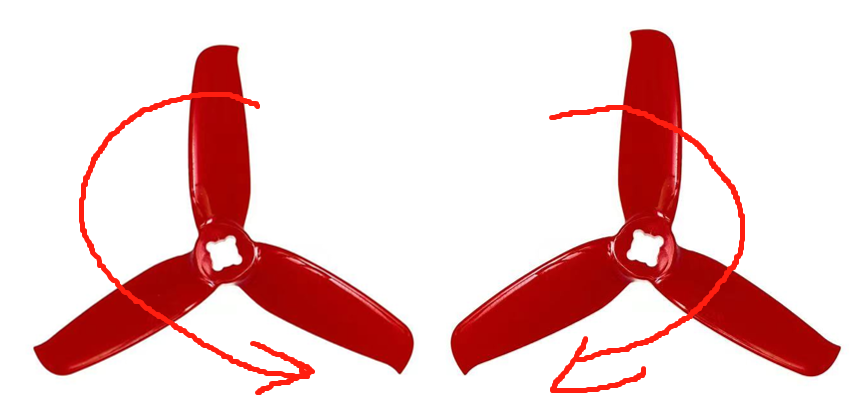

# Flight Tests

## 1.1 Pre-flight Test

1. Power the drone with the battery, but do not install the propellers.
2. Unlock the remote controller by moving the control sticks to the innermost position.
3. Gently push the throttle stick to spin up the motors.
4. Tilt the drone in different directions and verify if the motor speeds adjust appropriately. The motor closer to the ground should spin faster.
5. If the motor speed adjustment is not appropriate, recheck the parameter settings in step 1.7 and the levelness of the drone in step 1.8.

## 1.2 Sensor Recalibration

Connect the flight controller to a computer with QGC installed using a USB cable. Click on the G icon in the upper left corner, then select Vehicle Setup -> Sensor Calibration. Calibrate the Gyroscope, Accelerometer, and Level Horizon in sequence (for aircraft with an external magnetometer, also calibrate the magnetometer).

## 1.3 Installing Propellers

Take out a set of 4 propellers and first install the screw fixing seat in the center of each propeller. Note that propellers have a specific rotation direction. The thicker side is the leading edge, and the side with the pointed tip is the trailing edge. The image below shows that the propellers rotate in different directions on the left and right sides. The correct rotation direction is indicated by the arrow.

## 1.4 Flight Test

Read the first flight guidelines: <https://docs.px4.io/main/en/flying/first_flight_guidelines.html>
Find an open area to test fly, and be sure to control the throttle precisely.
Experienced pilots can fly as they wish.
