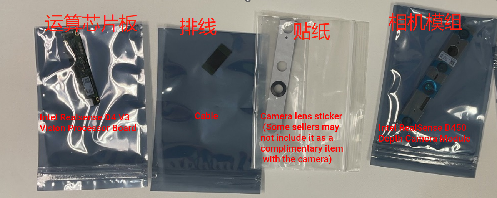

# Onboard Equipments

In this tutorial, the onboard computer used is the NVIDIA JETSON XAVIER NX combined with the HZHY 330 carrier board from Au-Zone. When using the Seeedstudio carrier board, the installation holes may be slightly different. The onboard computer runs Ubuntu 18.04 system. The camera used is the Realsense D455 without a housing module, that is, the Realsense D450.

## 1.1 Camera Installation

The camera comes with the accessories shown in the figure below, from left to right, they are the computing board, connection cable, black sticker, camera module. We also need to install the 3D-printed Realsense mounting base. The installation process is very simple. First, stick the black sticker on the side of the camera module with the lens. Then, install the camera module on the mounting base with the protruding screw holes on the ribbed side. Next, install the computing board on the back of the mounting base according to the screw holes, noting that there are two sets of holes on the back of the mounting base for installing the computing board. When using a straight-line cable (such as the one shown in the figure), the computing board is installed in the middle position. When using a Z-shaped cable, the computing board is installed in the edge position. The installation uses self-tapping screws of M2x8 or M2x6.




After installation, connect the ribbon cable. The final result with a Z-shaped ribbon cable is shown below. When using a straight ribbon cable, the result will be similar, with the computing board located closer to the center.

 
 


## 1.2 Installation of Onboard Computer

First, insert the TF card into the onboard computer to use as a hard drive. Then, insert the onboard computer into the mounting bracket from the back upper side, and use M2.6x8 self-tapping screws to fix the onboard computer. Note that there are two screws in the front and two in the back that need to be installed. The installation is shown in the figure below.


Then, fix the installed camera module in front of the onboard computer installation seat using M2.6x8 self-tapping screws, with the camera cable facing downwards. When installing, be careful not to pinch the cable. **A thin rubber sleeve or rubber pad can be placed on the screw between the camera module and the onboard computer installation seat for shock absorption.** The installation is shown in the following figure.


## 1.3 Connection between Onboard Computer and Camera

The onboard computer and Realsense camera are connected via a USB 3.0/3.1/3.2 cable. The Realsense end is a Type-C interface, and the HZHY H330 carrier board of the onboard computer has only one USB Type-C interface. Therefore, a USB hub is required to split the Type-C interface into multiple Type-A interfaces and connect the camera to one of them. Note that the USB hub can be attached to the small horizontal board behind the onboard computer.

## 1.4 Onboard Computer Configuration

Connect the keyboard, mouse, and monitor to the onboard computer, and power it using the onboard computer's built-in voltage regulator. Then, turn on the computer.
For the HZHY 330 carrier board, you need to first migrate the system to the TF card. Refer to the HZHY NVIDIA series carrier board document "Installing the System to the Expansion Disk.pdf" for migration instructions.
Install ROS and Realsense related drivers separately. Please refer to the official ROS website and Realsense website for installation instructions.
(<https://dev.intelrealsense.com/docs/nvidia-jetson-tx2-installation>)


After installation is complete, open the Ubuntu system command line, and then enter `realsense-viewer` to open the sample software. Check that the connection in the upper left corner is USB 3.0 or above. You can open the depth map, RGB image, etc. to view it. Using the ROS Wrapper, you can also retrieve the left and right infrared binocular images. If the connection is 2.0/2.1, it may be due to the USB Hub or the USB cable used is not 3.0. For the HZHY 330 carrier board, it may be due to an error in the USB 3.2 interface configuration. You need to open the `/etc/rc.local` file, add the two lines of commands circled in the figure below before `exit`, and then restart the onboard computer.

## 1.5 Installation of Onboard Computer and Mounting to Aircraft

During flight, the onboard computer needs to be powered by a separate power line from the battery or ESC soldering pad.
The mounting bracket for the onboard computer has four installation holes. Align the bracket with the corresponding holes on
the top of the aircraft, then use M2.6x8 self-tapping screws to mount it to the aircraft.


The drone after the installation is completed is as follows.


## 1.6 Connection Between Flight Controller and Onboard Computer

The onboard computer communicates with the flight controller by connecting a USB to TTL module to the USB port.
Note that the maximum baud rate supported by the onboard computer's built-in serial port is not high enough (generally up to 115200), so the USB to TTL module is necessary. It is recommended to use a CP2102 serial port module, or other serial port modules such as PL2303 or CH340 can also be used. For the onboard computer used in this manual, it has only one USB Type-C interface, so a USB hub is needed to connect both the USB to TTL and the Realsense camera.

## 1.7 Software Configuration

On the flight controller side, we completed the communication settings with the onboard computer (i.e. MAV_2, Onboard) in step 1.11. On the onboard computer side, we need to fix the device port number of the USB to TTL and start MAVROS to achieve communication, as follows:

1. Bind the device port number of the USB to TTL, which can refer to the method in <https://unix.stackexchange.com/questions/66901/how-to-bind-usb-device-under-a-static-name> and name the USB to TTL device with a name you want, such as PX4.
2. On the onboard computer, we need to install ROS and use the commands `sudo apt install ros-xxx-mavlink` and `sudo apt install ros-xxx-mavros` to install MAVROS. Use the command `roscd mavros` to open the `/opt/ros/xxx/share` folder where MAVROS is located. Then open the `Launch` folder where there is a launch file to start MAVROS, for example `px4.launch` for the PX4 firmware. We need to modify this file, but to avoid damaging the original file with incorrect modifications, we can copy and paste it to create a new file named `px4_companion.launch` using the command `sudo cp px4.launch px4_companion.launch`. Then, modify the `px4_companion.launch` file with the following changes:
   - Change the device name to `/dev/` followed by the name you gave to the USB to TTL device, for example `/dev/PX4`. If you forgot the name, you can use the command `ls /dev` to check.
   - Change the baud rate to 921600.
3. To check if the communication between the onboard computer and the flight controller is working properly. Here's a summary of the steps:
   - Start the MAVROS launch file by running `roslaunch mavros px4_companion.launch` on the onboard computer.
   - Check if the receive and transmit lights on the USB to TTL module are on or flashing, which indicates that communication is working properly.
   - Run `rostopic echo /mavros/state` command to check if the connection is normal.
   - If the connection is not normal, check if the hardware connection described in section 3.1 is correct and if the flight controller settings described in section 1.11 are correct.
     - If there is a serial port permission problem, you can use the following command to solve it once and for all.
       ```shell
       sudo usermod -a -G dialout $USER
       sudo apt-get remove modemmanager -y
       ```
       `After` logging out the system and logging in again, the permission manager of the onboard computer will be uninstalled to avoid the serial port The problem of no permission to open the serial port will be avoided.

---

# Problem Lists

1. _SKU Invalid_ when plugin the realsense camera

   According to Intel forum, directly update the firmware for D4 V3 board without D450 camera module. Solved.

2. When launch the realsense node, continuously receiving error: `control_transfer returned error, index: 768`

   Solution: `sudo apt purge ros-noetic-librealsense2`

3. `lsusb` or `rs-capture` takes too long time to response

   The only reason is the HSF100 cable is not well connected, chech the hardware connection and pins.

## Intel WiFi modules

I don't know if this works. If direct plugin works then you can skip these steps.

https://www.intel.com/content/www/us/en/support/articles/000005511/wireless.html

1. Install the corresponding firmware
2. Use `tar xzf` to unzip
3. Copy the `.ucode` file under `/lib/firmware/`
